# OncoFusion-Breast: Multimodal Breast Cancer Outcome Modeling

A multimodal machine learning project for breast cancer analysis using clinical features, genomic signals, and image-based workflows. This repository contains notebooks, pre-trained models, and curated datasets for survival/risk modeling and exploratory diagnostics.

## Key Performance Snapshot

- Clinical model best observed accuracy: 100.0%
- Clinical model test accuracy: 88.25%
- Genomic model best observed test accuracy: 79.86%
- Clinical model AUC: 1.0000

## Suggested GitHub Repository Name

oncofusion-breast-multimodal-outcome-modeling

Alternative short name:

breast-cancer-multimodal-ml

## What Is Included

- Clinical modeling notebook: `breastCancerClinical.ipynb`
- Genomic modeling notebook: `breastCancerGenomic_Model.ipynb`
- Multimodal notebook scaffold: `BreastCancermultimodal.ipynb`
- Additional image and multimodal experiments under `BreastCancer/`
- Pre-trained models:
  - `breast_cancer_clinical_model.h5`
  - `breast_cancer_survival_model.h5`
  - `BreastCancer/best_multimodal_model.pth`
  - `BreastCancer/best_real_multimodal_model.pth`
- Data folders:
  - `brca_metabric/`
  - `breast_msk_2018/`

## Environment Setup

1. Create and activate a virtual environment.

```bash
python3 -m venv .venv
source .venv/bin/activate
```

2. Install dependencies.

```bash
pip install -r requirements.txt
```

3. Launch Jupyter.

```bash
jupyter notebook
```

## Techniques Used in This Project

### 1) Data Preparation and Cleaning

- Clinical and genomic tabular data loading with `pandas`
- Label encoding for categorical variables using `LabelEncoder`
- Numeric feature normalization with `StandardScaler`
- Train/validation/test splitting with `train_test_split`

### 2) Feature Engineering and Selection

- Domain-driven clinical/genomic feature selection
- Model input alignment across clinical and molecular attributes
- Saved preprocessing artifacts (`*.pkl`) for reproducible inference pipelines

### 3) Deep Learning for Risk Classification

- Feed-forward neural networks built with TensorFlow/Keras (`Sequential`, `Dense`)
- Binary classification training with Adam optimizer
- Early stopping used in genomic modeling to reduce overfitting

### 4) Class Imbalance Handling

- Imbalance-aware workflow in genomic modeling using `imblearn` tools
- Threshold-oriented evaluation to improve minority-class sensitivity

### 5) Evaluation and Validation

- Confusion matrix analysis (`confusion_matrix`)
- Precision, recall, F1-score, and accuracy tracking
- ROC and AUC based discrimination analysis
- Validation-loss monitoring and best-epoch selection

### 6) Explainability and Interpretation

- SHAP-based feature contribution analysis for model interpretability
- Feature importance and effect visualization for clinical/genomic predictors

### 7) Multimodal and Imaging Components

- Additional imaging/segmentation experiments in the `BreastCancer/` module
- Training-history, threshold-optimization, and segmentation-prediction visual outputs

## Reproducible Outputs (From Saved Notebook Runs)

### Clinical Model (`breastCancerClinical.ipynb`)

Observed metrics from saved outputs:

- Accuracy: 98.25%
- Precision: 1.0000
- Recall: 0.9524
- F1-score: 0.9756
- AUC: 1.0000
- Best observed accuracy in saved run: 100.0%

### Genomic Model (`breastCancerGenomic_Model.ipynb`)

Observed metrics from saved outputs:

- Best validation loss: 0.6091 (epoch 21)
- Best validation accuracy: 0.6528
- Test accuracy: 78.12%
- Test precision: 0.3190
- Test recall: 0.5873
- Test F1: 0.2588
- Test AUC: 0.6296
- Additional run:
  - Accuracy: 79.86%
  - Precision: 0.3077
  - Recall: 0.5079
  - F1-score: 0.3830
  - AUC: 0.6377

## Output Visuals

All documentation images are stored in `assets/images/` for clean GitHub publishing.

### Segmentation Result Images

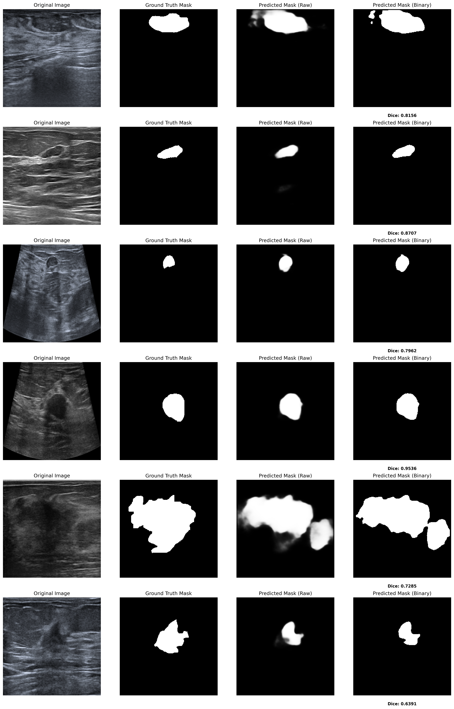

### Explainability Summary Images

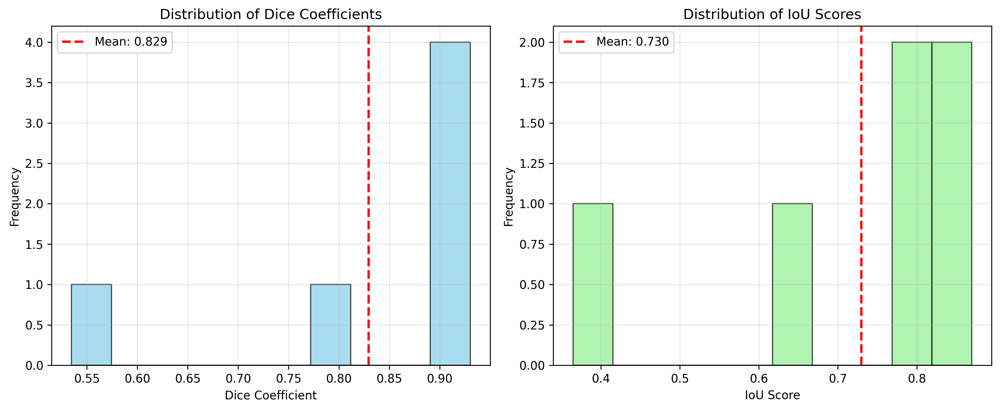

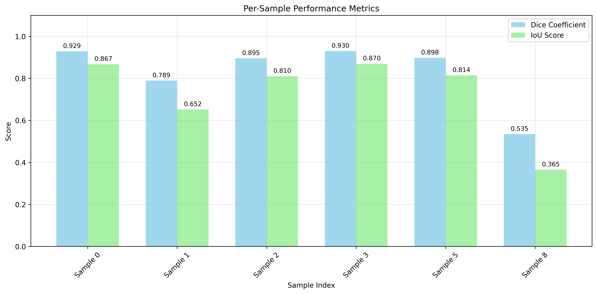

### Explainability Sample Images

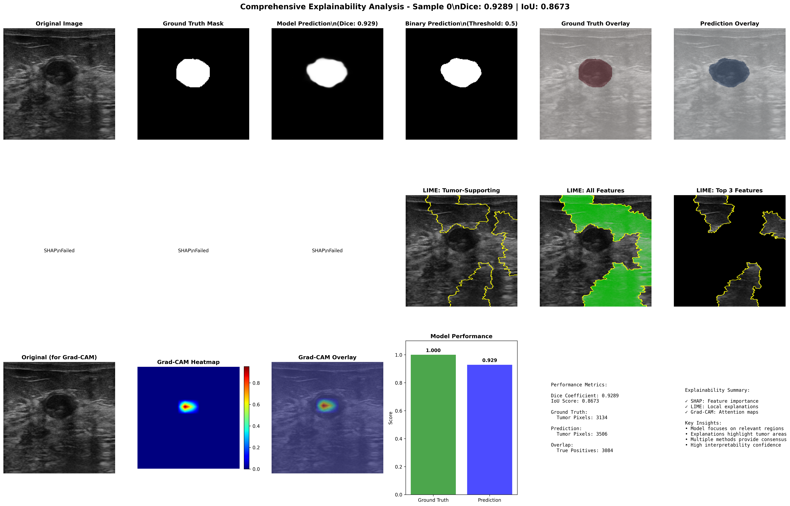

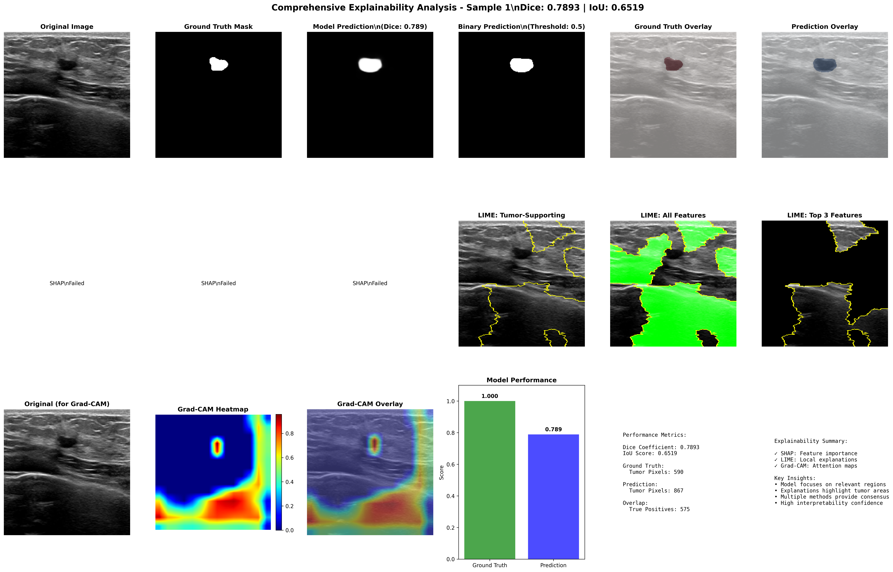

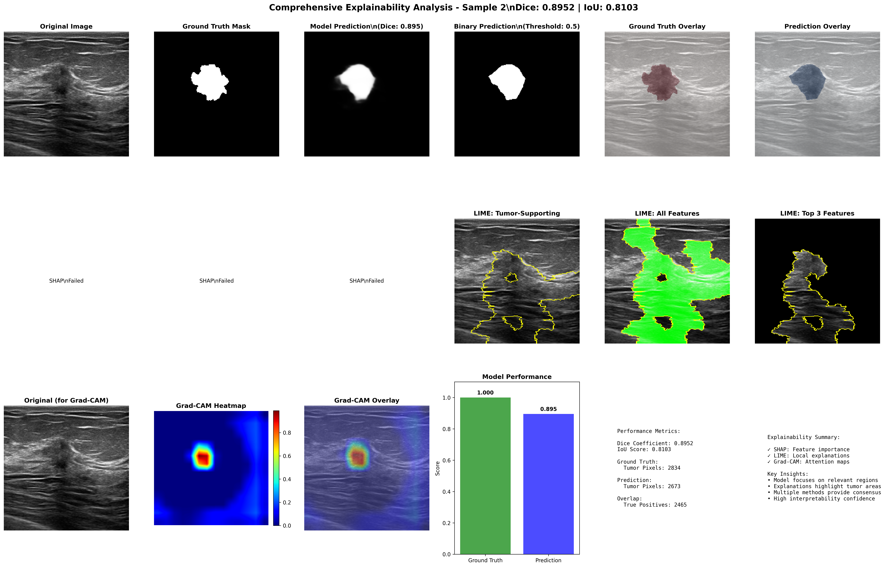

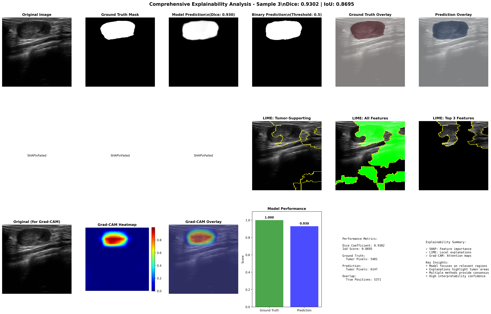

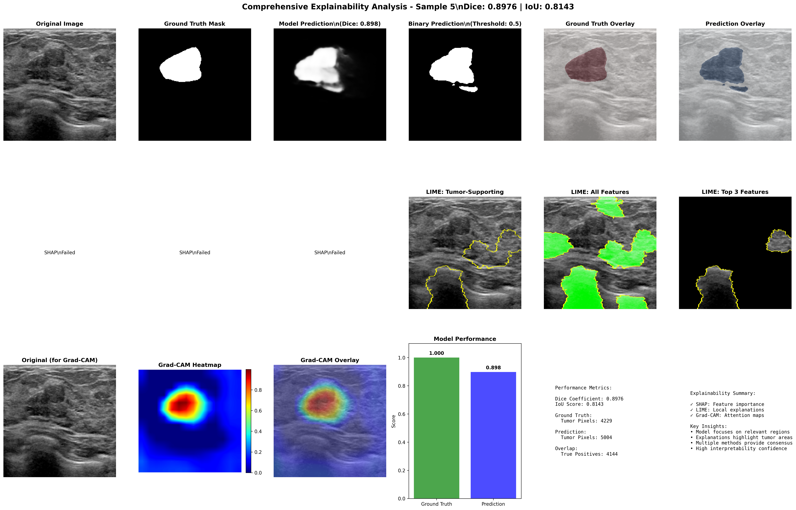

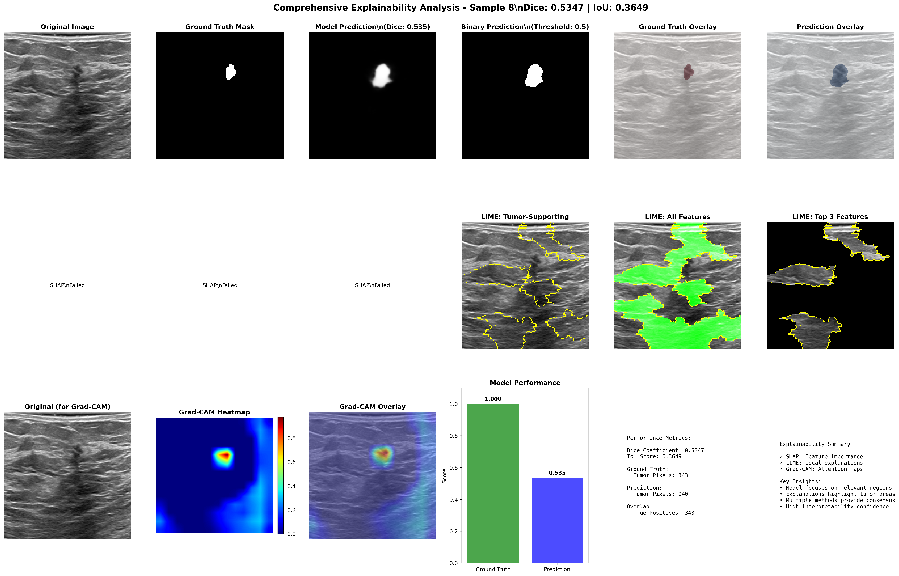

### Performance Result Images

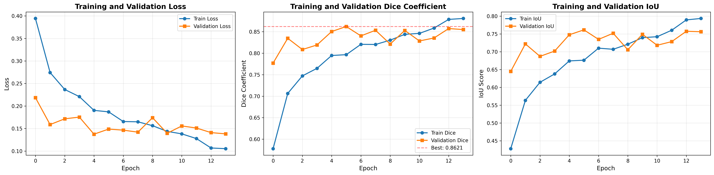

### Threshold Optimization

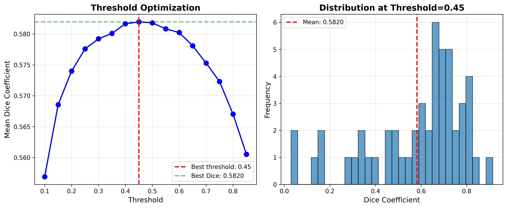

### Dice Score Distribution

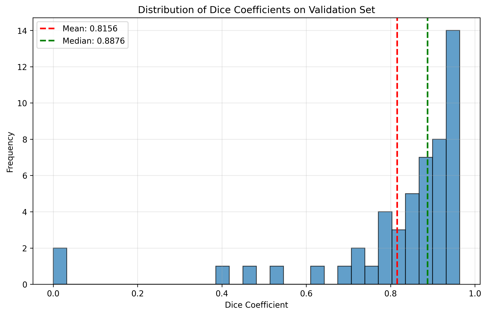

## Known Execution Notes

- The genomic notebook contains saved error outputs related to NumPy/API compatibility (`_ARRAY_API`) in one run.
- `requirements.txt` pins `numpy==1.26.4`, which should be used to avoid NumPy 2.x compatibility issues.
- Some SHAP-related cells show a shape assertion error in a saved run. Review feature matrix alignment before rerunning explainability cells.

## Project Structure (Top Level)

```text
.
├── breastCancerClinical.ipynb
├── breastCancerGenomic_Model.ipynb
├── BreastCancermultimodal.ipynb
├── breast_cancer_clinical_model.h5
├── breast_cancer_survival_model.h5
├── assets/
│   └── images/
├── requirements.txt
├── brca_metabric/
├── breast_msk_2018/
└── BreastCancer/
```

## Prepare and Push to GitHub

1. Initialize Git and add files.

```bash
git init
git add .
```

2. Create initial commit.

```bash
git commit -m "Initial commit: multimodal breast cancer modeling project"
```

3. Create repository on GitHub and push.

```bash
git branch -M main
git remote add origin https://github.com/<your-username>/oncofusion-breast-multimodal-outcome-modeling.git
git push -u origin main
```

## License and Data Usage

Dataset subfolders include their own metadata and licensing files (for example, `LICENSE` and study metadata inside `brca_metabric/` and `breast_msk_2018/`). Use data according to source terms.
